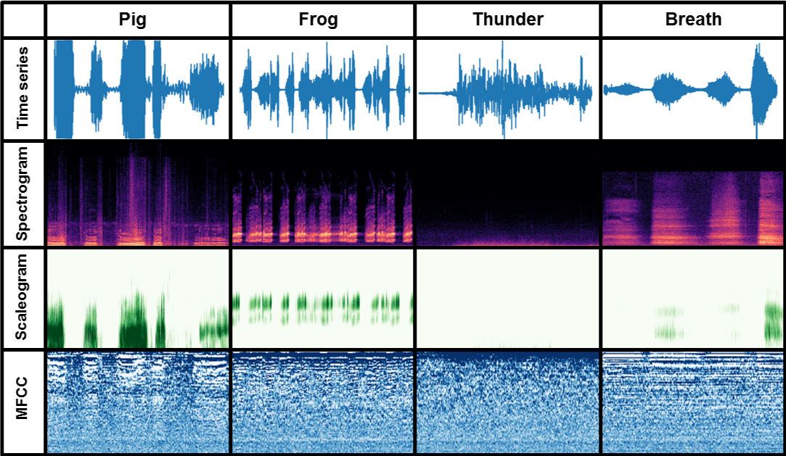
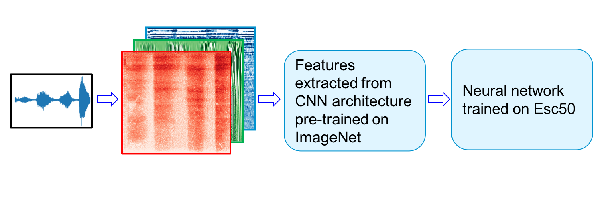

## RGB representation of sound for environmental sound classification:

## Dataset description:

The **ESC-50 dataset** is a labeled collection of 2000 environmental audio recordings suitable for benchmarking methods of environmental sound classification.

The dataset consists of 5-second-long recordings organized into 50 semantical classes (with 40 examples per class) loosely arranged into 5 major categories:

| Animals | Natural soundscapes & water sounds  | Human, non-speech sounds | Interior/domestic sounds | Exterior/urban noises |
| :--- | :--- | :--- | :--- | :--- |
| Dog | Rain | Crying baby | Door knock | Helicopter |
| Rooster | Sea waves | Sneezing | Mouse click | Chainsaw |
| Pig | Crackling fire | Clapping | Keyboard typing | Siren |
| Cow | Crickets | Breathing | Door, wood creaks | Car horn |
| Frog | Chirping birds | Coughing | Can opening | Engine |
| Cat | Water drops | Footsteps | Washing machine | Train |
| Hen | Wind | Laughing | Vacuum cleaner | Church bells |
| Insects (flying) | Pouring water | Brushing teeth | Clock alarm | Airplane |
| Sheep | Toilet flush | Snoring | Clock tick | Fireworks |
| Crow | Thunderstorm | Drinking, sipping | Glass breaking | Hand saw |

A detailed description of the dataset is available at **[ESC-50 dataset](https://github.com/karoldvl/ESC-50)** where it can be downloaded (~600 MB)

> K. J. Piczak. **ESC: Dataset for Environmental Sound Classification**. *Proceedings of the 23rd Annual ACM Conference on Multimedia*, Brisbane, Australia, 2015.
>
> [DOI: http://dx.doi.org/10.1145/2733373.2806390]

## Converting sound to RGB picture

Audio have many different ways to be represented, going from raw time series to time-frequency decompositions. The choice of the representation is crucial for the performance of your system. Initially, the ESC task was many carried out based on   handcrafted features  or Mel-frequency cepstral coefficients (MFCCs). More recently, time frequency representations have been particularly useful [20] for environmental sound classification. Indeed, they better captures the non-stationarity and dynamic nature of the sound. Additionally, they are adapted to the use of convolutional neural networks (CNNs) that recently revolutionized the computer vision field.
Among time-frequency decompositions, Spectrograms have been proved to be a useful representation for ESC task, and more generally for audio processing. They consist in 2D images representing sequences of Short Time Fourier Transform (STFT) with time and frequency as axes, and brightness representing the strength of a frequency component at each time frame. In such they appear a natural domain to apply CNNS architectures for images directly to sound.

Another less commonly used representation is the Scalogram, 2 dimensional output of the wavelet transform with scale and time as axes. As wavelet can filter signal in a multiscale way, scalogram may outperform spectrogram for the ESC task.

In this project, sound is represented as a RGB colour image, red being spectrogram, green being scalogram and blue MFCC.

## Classifying environmental sound using transfer learning

Environmental sound data generally suffers from limited labeled datasets, and ESC-50 is not an exception. This makes it difficult to train deep models from scratch. On the contrary, In computer vision, the availability of large datasets such as ImageNet enabled to train very deep models for the task of image classification. Since 2012, state of the art computer vision networks have been trained on ImageNet, a dataset containing approximatively 1.2 million images separated into 1000 categories. Best performing architectures relied on convolutional neural networks and some of the pre-trained weights are available in the [Keras library](https://keras.io).

Among them, we considered [VGG19](https://arxiv.org/abs/1409.1556), [InceptionResnetv2](https://arxiv.org/abs/1602.07261) and [Xception](https://arxiv.org/abs/1610.02357).

VGG19 is composed of convolutional layers of 3x3 filters and is characterized by its simplicity. InceptionResnetv2 combined the inception module acting as a multi-level feature extractor with the residual connections to accelerate the training. Finally, Xception is an extension of Inception architecture with the use of depthwise separable convolutions.
The pre-trained weights of these networks can be used as features extractors on our RGB representation of sound in a transfer learning approach.

